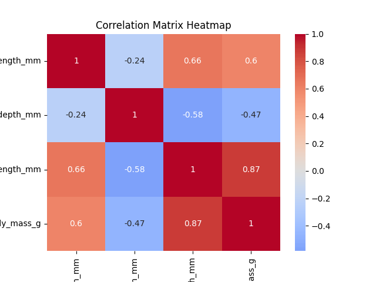
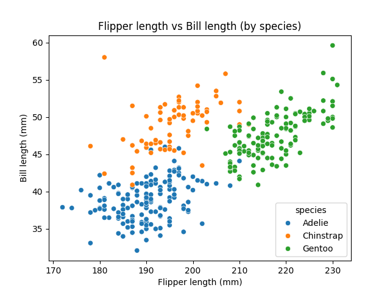

# datafun-04-notebooks

[](https://denisecase.github.io/pro-analytics-02/workflow-b-apply-example-project/)
[](./pyproject.toml)
[](./LICENSE)

> Professional Python project: exploratory data analysis with Jupyter notebooks.

Data analytics requires a variety of skills.
This course builds capabilities through working projects.

In the age of generative AI, durable skills are grounded in real work:
setting up a professional environment,
reading and running code,
understanding the logic,
and pushing work to a shared repository.
Each project follows the structure of professional Python projects.
We learn by doing.

## This Project

This project introduces **Exploratory Data Analysis (EDA)** using Jupyter notebooks.

When we encounter a new dataset, we want to explore quickly:
run checks, view distributions, identify missing values or outliers.
Notebooks combine Markdown narrative with Python code cells and are ideal for this kind of investigation.

You will run the example notebook, read the code and narrative,
and create your own notebook to explore a different tabular dataset.

## Working Files

You'll work with just these areas:

- **docs/** - the project narrative and documentation
- **src/datafun** - supporting Python module
- **notebooks/** - where the analysis happens
- **pyproject.toml** - update authorship & links
- **zensical.toml** - update authorship & links

## Instructions (pro-analytics-02)

Follow the
[step-by-step workflow guide](https://denisecase.github.io/pro-analytics-02/workflow-b-apply-example-project/)
to complete:

1. Phase 1. **Start & Run**
2. Phase 2. **Change Authorship**
3. Phase 3. **Read & Understand**
4. Phase 4. **Modify**
5. Phase 5. **Apply**

## Challenges

Challenges are expected.
Sometimes instructions may not quite match your operating system.
When issues occur, share screenshots, error messages, and details about what you tried.
Working through issues is part of implementing professional projects.

## Success

After completing Phase 1. **Start & Run**, you'll have your own GitHub project,
with the example notebook executed and committed,
and running the example script will print out:

```shell
========================
Executed successfully!
========================
```

A new file `project.log` will appear in the root project folder.

## Command Reference

The commands below are used in the workflow guide above.
They are provided here for convenience.

Follow the guide for the **full instructions**.

<details>
<summary>Show command reference</summary>

### In a machine terminal (open in your `Repos` folder)

After you get a copy of this repo in your own GitHub account,
open a machine terminal in your `Repos` folder:

```shell
# Replace username with YOUR GitHub username.
git clone https://github.com/j-carne/datafun-04-notebooks

cd datafun-04-notebooks
code .
```

### In a VS Code terminal

These are listed for convenience.
For best results, follow the detailed instructions in
[pro-analytics-02 guide](https://denisecase.github.io/pro-analytics-02/)
to complete:

```shell
uv self update
uv python pin 3.14
uv sync --extra dev --extra docs --upgrade

uvx pre-commit install

git add -A
uvx pre-commit run --all-files
# repeat if changes were made
uvx pre-commit run --all-files

# run the module to verify the environment (.venv)
uv run python -m datafun.app_case

# do chores
uv run ruff format .
uv run ruff check . --fix
uv run python -m pyright
uv run python -m pytest
uv run python -m zensical build

# save progress
git add -A
git commit -m "update"
git push -u origin main
```

</details>

## Notes

- Use the **UP ARROW** and **DOWN ARROW** in the terminal to scroll through past commands.
- Use `CTRL+f` to find (and replace) text within a file.
- You do not need to add to or modify `tests/`. They are provided for example only.
- Many files are silent helpers. Explore as you like, but nothing is required.
- You do NOT not to understand everything; understanding builds naturally over time.

## Troubleshooting >>>

If you see something like this in your terminal: `>>>` or `...`
You accidentally started Python interactive mode.
It happens.
Press `Ctrl+c` (both keys together) or `Ctrl+Z` then `Enter` on Windows.

## Example Output (Can Remove this Section after You Verify)

```shell
| INFO | EDA | --- Section 9: Summary and next steps ---
| INFO | EDA | ========================
| INFO | EDA | SUMMARY
| INFO | EDA | ========================
| INFO | EDA | Dataset: penguins
| INFO | EDA | Original rows: 344
| INFO | EDA | Clean rows:    342
| INFO | EDA | Groups found in species: ['Adelie', 'Chinstrap', 'Gentoo']
| INFO | EDA | Strongest correlation:
| INFO | EDA |   flipper_length_mm and body_mass_g (~0.87)
| INFO | EDA | Suggested next step:
| INFO | EDA |   Model body_mass_g ~ flipper_length_mm with linear regression
| INFO | EDA | ----- in a script, call plt.show() once at the end to display all charts -----
| INFO | EDA | EDA workflow complete
| INFO | EDA | IMPORTANT: This script creates chart windows.
| INFO | EDA | Close any chart windows and terminate this process with CTRL+c as needed.
| INFO | EDA | ========================
| INFO | EDA | Executed successfully!
| INFO | EDA | ========================
```

## Findings and Visuals

Take screenshots of your charts and provide them here with a discussion.
In Markdown, display a figure by using:
an exclamation mark immediately followed by square brackets containing a useful caption
immediately followed by parentheses containing the relative path to your figure.
Note: When you start typing the path with a dot (.) for "here, in this directory",
the IDE may help complete the path.

Follow this example, but the figures should
reflect your work and include your narrative.
Remove unnecessary instructional comments in your final version of this README.md.






## Modification

- Copied `eda_case.ipynb` and renamed it `eda_jcarne.ipynb`
- Updated the notebook header with my name, repository link, and date
- Added a new histogram chart (Chart 3) showing the distribution of
  body mass by species using sns.histplot()
- The histogram revealed that Gentoo penguins are clearly heavier than
  Adelie and Chinstrap penguins, with very little overlap in their
  body mass distributions

## Applied Project — Dynon Flight Data EDA (eda_jcarne_dynon.ipynb)

This notebook applies the EDA workflow to real flight data exported from
a Dynon avionics system. The analysis explores relationships between
cylinder head temperatures (CHT) and indicated airspeed across a full flight.

### Dataset

- **File:** `data/raw/dynon_data.csv` (excluded from repo due to file size)
- **Rows:** 14,133 total, 14,122 after cleaning (only 9 rows dropped)
- **Columns analyzed:** CHT 1-4 (deg C), Indicated Airspeed (knots)
- **Grouping variable:** GPS Fix Quality (0.0, 1.0, 2.0)

### Key Findings

| Columns | Correlation |
|---------|-------------|
| CHT 1 and CHT 2 | ~1.0 |
| CHT 3 and CHT 4 | ~1.0 |
| CHT 1 and Airspeed | ~0.80 |
| CHT 2 and Airspeed | ~0.82 |
| CHT 3 and Airspeed | ~0.70 |
| CHT 4 and Airspeed | ~0.72 |

All four cylinders heat and cool together, confirming balanced engine
performance. CHT rises with airspeed as power demand increases, with
front cylinders (1 and 2) showing a slightly stronger relationship
than rear cylinders (3 and 4).

GPS fix quality acts as a natural proxy for flight phase — no GPS lock
corresponds to ground operations at lower and more variable temperatures,
while GPS-locked data captures stable in-flight engine temperatures.

### Visualizations


### Suggested Next Steps

- Model CHT ~ Indicated Airspeed with linear regression (Module 7)
- Investigate why front cylinders correlate more strongly with airspeed
- Analyze EGT columns alongside CHT for a complete engine health picture
- Compare multiple flights to identify trends over time

### How to Run

```shell
uv run jupyter lab
```

Then open `notebooks/eda_jcarne_dynon.ipynb` and click **Run All**.
The main additions were the Dynon project section at the bottom with the findings table, visualization placeholders, and next steps. I also added the dynon_data.csv note in the Notes section and the uv run jupyter lab command in the command reference.
When you're ready, save screenshots of your three charts into docs/images/ and the image links will display them automatically.This chat has 93 of 100 images (including PDF pages). Consider starting a new chat.
